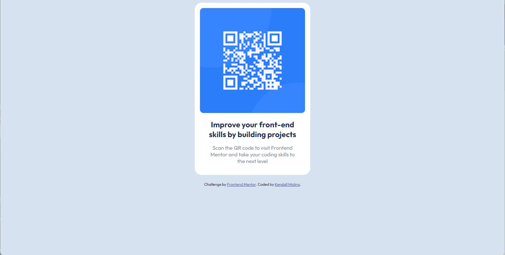

# Frontend Mentor - QR code component solution

This is a solution to the [QR code component challenge on Frontend Mentor](https://www.frontendmentor.io/challenges/qr-code-component-iux_sIO_H). Frontend Mentor challenges help you improve your coding skills by building realistic projects. 

## Table of contents

- [Overview](#overview)
  - [Screenshot](#screenshot)
  - [Links](#links)
- [My process](#my-process)
  - [Built with](#built-with)
  - [What I learned](#what-i-learned)
  - [Continued development](#continued-development)
  - [Useful resources](#useful-resources)
- [Author](#author)

## Overview

### Screenshot

### Links

- Solution URL: [Frontend Mentor](https://www.frontendmentor.io/solutions/qr-code-component-using-html-and-css-Q6HW7-hWGq)
- Live Site URL: [GitHub Pages](https://kendi-m.github.io/QR-code-component/)

## My process

### Built with

- Semantic HTML5 markup
- CSS custom properties

### What I learned

Since I only had access to the starter files, I resized the desktop browser window to 1440px and the desktop-design.jpg to 100% in order to match the size as close as possible. 

### Continued development

It was relatively easy to copy the design. Although for the CSS, I'm not sure if there is a standard way to organize the properties (elements, IDs, classes, etc.)

### Useful resources

- [W3 School - CSS Rounded Borders](https://www.w3schools.com/css/css_border_rounded.asp) - This helped me to change the border radius for the div and image.

## Author

- Frontend Mentor - [@Kendi-M](https://www.frontendmentor.io/profile/yourusername)